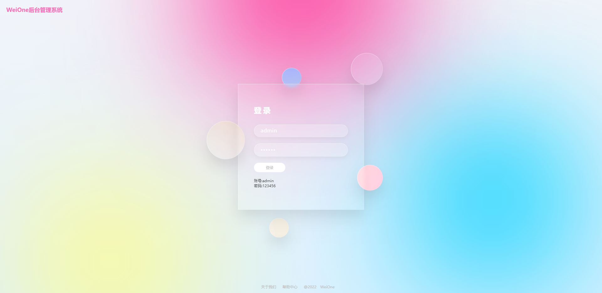
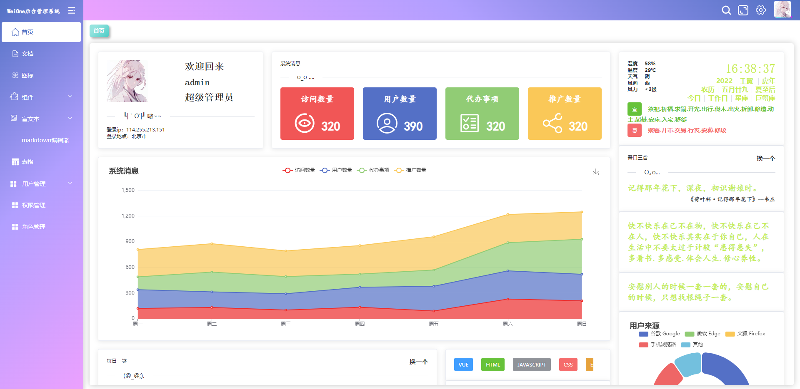

# Weione后台管理系统
🎉✨🌹👍 基于vue2+element-ui使用mock模拟数据
>注：此项目为新手入门项目(¬‿¬)
## 技术栈
> vue2+element-ui+axios+sass+mock+echarts+vuex
## 项目截图
+ 登录页

<!-- + 首页 -->
<!--  -->
## 项目功能
- [x] 登录/退出
- [x] 首页各项配置
- [x] IP
- [x] 地址
- [x] 文档
- [x] 组件
- [x] 富文本
- [x] 表格
- [x] 权限
- [x] 图表
- [x] 图标

## 启动命令

``` bash
# 下载依赖
npm install

# 运行locahost:9000
npm run dev
```
